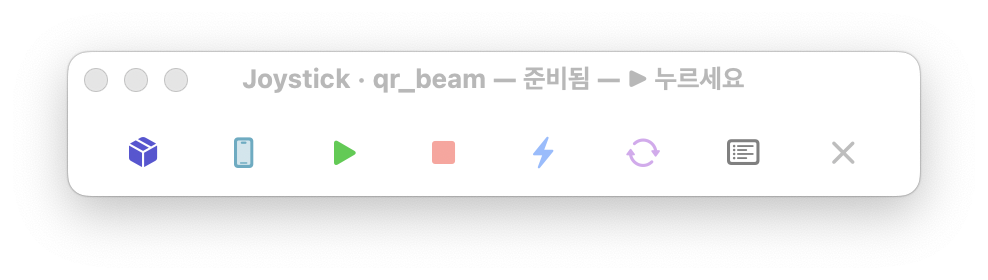
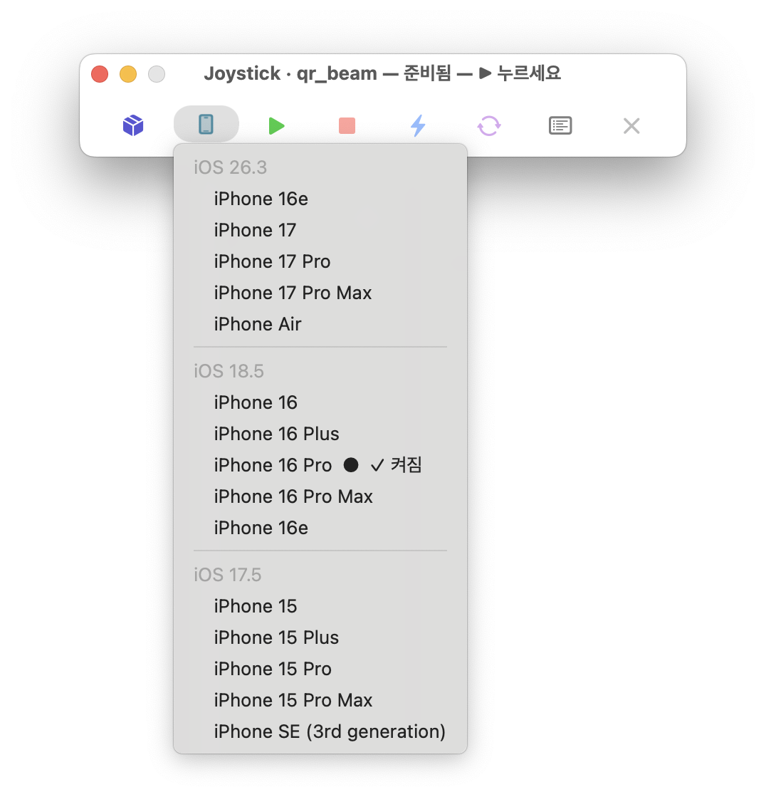

# Joystick 🕹️

[English](README.md) · **한국어**

Flutter 개발할 때 **시뮬레이터 켜고 Hot Reload 하는 것**만 하는 macOS 미니 패널.
VSCode·Xcode 같은 무거운 거 안 켜고, 작은 창 하나로 끝낸다.



한 줄짜리 슬림 창, 항상 맨 위에 떠 있음. 버튼은 좌→우:
📦 프로젝트 · 📱 시뮬레이터 · ▶ Run · ■ Stop · ⚡ Hot Reload · ↻ Hot Restart · ☰ 로그 · ✕ 종료

## 왜 만들었나

코드 조금 고치고 Hot Reload 한 번 하려고 매번 VSCode 같은 IDE 를 켜고, 시뮬레이터
띄우려고 Xcode·Simulator 를 또 켜고… 매번 이게 귀찮았다. 정작 자주 누르는 버튼은
몇 개뿐인데.

그 버튼들만 쏙 빼서 작은 창에 늘 띄워둔 게 Joystick. **시뮬레이터 켜기(📱)도, 앱
실행(▶)도, Hot Reload(⚡)도 전부 이 창 하나에서.** IDE 도 Xcode 도 터미널도 따로
켤 필요 없다.

## 설치

### Claude Code 사용자 (제일 쉬움)
이 저장소 링크를 Claude 에게 주고 시키면 끝:

> "이 repo 클론해서 Joystick 설치해줘: `<repo-url>`"

루트의 [`CLAUDE.md`](./CLAUDE.md) 를 읽고 요구사항 확인 → 빌드 → 실행까지 알아서 한다.

### 직접 설치
```bash
git clone <repo-url> joystick
cd joystick
./build.sh
open Joystick.app
```

## 요구사항

- macOS 13+
- Xcode Command Line Tools — `xcode-select --install`
- Flutter — **경로는 앱이 알아서 찾는다** (설치만 돼 있으면 됨)

## 쓰는 법

1. 📦 프로젝트 고르기 (켜면 가장 최근 만진 프로젝트가 자동 선택돼 있음)
2. 📱 시뮬레이터 고르기 → **알아서 켜진다** (Simulator 앱 따로 안 켜도 됨)
3. ▶ Run → 빌드 후 실행
4. 코드 고치고 ⚡ Hot Reload (또는 ↻ Hot Restart)

📱 를 누르면 설치된 iOS 시뮬레이터가 버전별로 묶여 나온다 (켜져 있는 기기엔 ✓).
고르면 그 자리에서 부팅까지 해준다 — 따로 시뮬레이터 앱을 찾아 켤 필요 없다:



프로젝트 루트에 `.env.local`(`KEY=VALUE`) 이 있으면 자동으로 앱에 넣어준다.

## 특징

- 작은 창 하나로 끝 — 시뮬레이터 켜기·실행·Hot Reload 전부 여기서
- **IDE·Xcode·터미널 따로 켤 필요 없음**
- 켜면 최근 만진 Flutter 프로젝트를 알아서 골라줌
- flutter 경로도 알아서 찾음 (설치만 돼 있으면 됨)
- 파일 하나로 끝, 외부 라이브러리 0

iOS 시뮬레이터 전용 · macOS 전용
